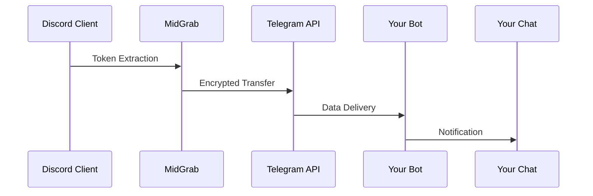

# 🔥 MidGrab - Advanced Discord Token Grabber

  
*Dynamic RGB interface with real-time operation console*

## 📌 Core Features
- **Telegram Data Exfiltration** - Securely sends acquired tokens to your Telegram bot
- **GUI-Based Configuration** - No config files needed (all settings via visual interface)
- **Stealth Operation** - Runs completely invisible in background
- **Self-Updating Mechanism** - Maintains persistence through Discord's update system
- **Dynamic RGB UI** - Customizable visual interface with real-time feedback

## 🛠️ How It Works
1. **Input Your Telegram Details**:
   - Bot Token (From @BotFather)
   - Chat ID (Where to receive data)

2. **Configure Build Settings**:
   - Choose output EXE location
   - Optional: Embed custom icon

3. **One-Click Compilation**:
   - Builds customized executable
   - Validates all components
   - Provides completion notification

## 📦 Data Collection Pipeline

## 💻 Technical Specifications
- **Target**: Discord Desktop Client (Stable/PTB/Canary)
- **Injection Point**: `%appdata%/discord/[version]/modules/discord_desktop_core`
- **Persistence Method**: Modified `index.js` with auto-restart
- **Communication**: HTTPS to Telegram API
- **Obfuscation**: Random delays + TLS 1.2 encryption

## 📡 Telegram Integration
1. Create bot with @BotFather
2. Start chat with your bot
3. Get your Chat ID using @userinfobot
4. Enter credentials in MidGrab GUI

## ⚠️ Legal Disclaimer
This software is provided for **educational purposes only**. Unauthorized use violates:
- Discord's Terms of Service
- Computer Fraud and Abuse Act (18 U.S.C. § 1030)
- Various international privacy laws

**By using this tool, you agree to:**
1. Only test on accounts you own
2. Not distribute collected data
3. Assume all legal responsibility

## 🌟 Why MidGrab?
- **No Config Files** - All settings managed via GUI
- **Visual Feedback** - RGB status indicators and console
- **Precision Targeting** - Only modifies necessary files
- **Self-Cleaning** - Leaves no traces after operation

## 📜 License
Custom Restricted License:
- **Allowed**: Personal research
- **Prohibited**: Commercial/military use
- **Required**: Original author attribution
- **Special**: Government/law enforcement must contact developer
